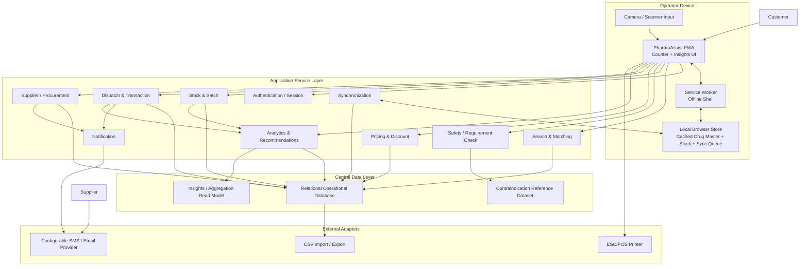
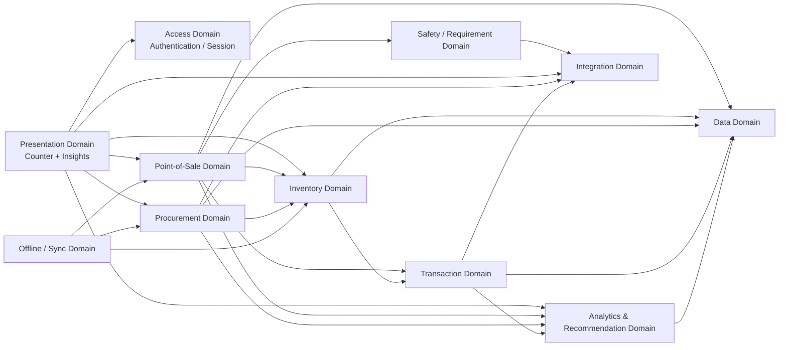
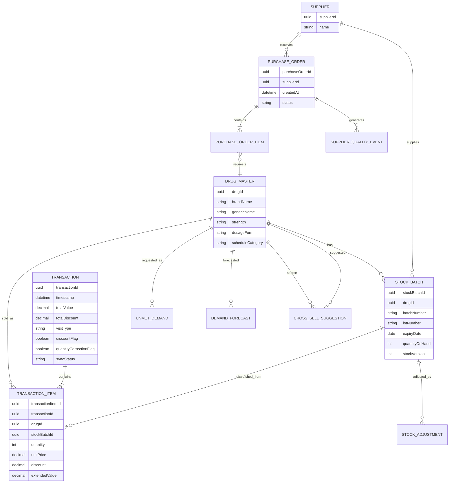
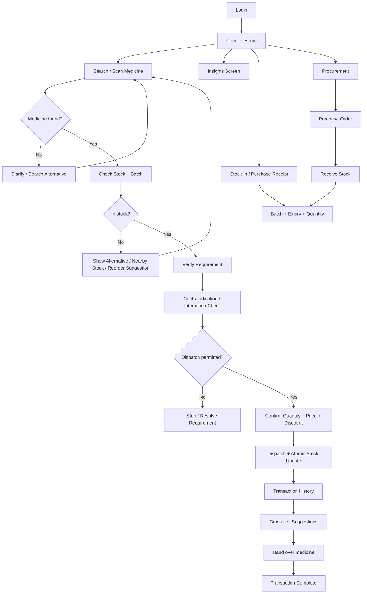

# Software Design Document (SDD)

## PharmaAssist - AI-Augmented Point-of-Sale, Inventory and Analytics System for Retail Pharmacy

**Document type:** Software Design Document  
**Prepared for:** PGDM Internship / Applied Research Deliverable  
**SRS baseline:** PharmaAssist SRS v2.1  
**Design baseline:** As-Is and To-Be pharmacy counter process maps  
**SDD guide:** HIT701 SDLC Studio - Writing the Software Design Document (Annexure D)  
**Document version:** 0.1  
**Date:** 28 September 2026  
**Status:** Draft for design review

---

# Section 1 - Project Description

## 1.1 Project

**PharmaAssist** is a mobile-first, web-based pharmacy counter application for a single salesperson/operator. It replaces a manual, paper- and memory-based workflow with a structured digital workflow covering drug search, stock and batch verification, substitute identification, requirement and contraindication checking, price and discount calculation, dispatch, stock update, transaction-history logging, supplier procurement records, and a single-screen operational insights view.

The design is derived from the SRS and the As-Is / To-Be process maps. The As-Is process shows repeated manual identification, physical stock checking, manual substitute search, manual verification, paper/memory transaction recording, and supplier follow-up. The To-Be process converts these steps into a connected digital flow using a central medicine master, stock and batch records, transaction logging, procurement records, and AI/system-assisted recommendations.

## 1.2 Description

The first release is designed for exactly one operator. The operator uses the same browser-based application at the counter, in the stock room, and during supplier ordering. Customer and supplier activities are represented as external process participants, not application users.

The design uses a mobile-first Progressive Web App (PWA) approach so the core workflow can be used on a phone, tablet, or desktop browser without a native app-store installation. Offline operation is implemented through locally cached master and stock data plus a synchronization queue. The central data layer remains the authoritative source after synchronization.

The AI-assisted functions are intentionally separated from safety-critical deterministic rules. AI/system assistance may rank generic/brand alternatives, generate demand forecasts, suggest cross-sell items, and support procurement recommendations. Contraindication and interaction checking uses the selected reference dataset and explicit rules rather than allowing a generative model to originate clinical rules.

## 1.3 Revision History

| Version | Date | Author | Change |
|---|---|---|---|
| 0.1 | 28 Sep 2026 | Project Team | Initial SDD derived from SRS v2.1 and As-Is / To-Be process maps |
| 0.2 | TBD | Project Team | Architecture, data and UI refinements after design review |
| 1.0 | TBD | Project Team | Design baseline approved for development |

## 1.4 Design Principles

1. **Requirement traceability:** every significant design element shall trace to one or more SRS requirements.
2. **Single-operator scope:** no role hierarchy, manager account, or multi-user workflow is introduced.
3. **Mobile-first operation:** counter tasks remain operable at 360 px width and through touch.
4. **Offline continuity:** transaction capture shall continue during loss of internet connectivity within the limits of the SRS.
5. **Single authoritative stock ledger:** stock changes are generated only through defined transaction paths.
6. **Safety separation:** clinical reference checking is isolated from recommendation/forecasting components.
7. **No payment processing:** the system records the transaction value but does not collect or settle payment.
8. **One-screen insights:** analytics are exposed as a single operational screen rather than an enterprise BI dashboard.
9. **Config-driven master data:** routine drug, supplier and threshold changes do not require code changes.
10. **Explainable operational assistance:** recommendation features shall present their underlying operational basis, such as stock status, demand history, co-purchase frequency, or supplier history.

---

# Section 2 - Overview

## 2.1 Purpose of the SDD

This SDD converts the requirements in the PharmaAssist SRS into a build-oriented design. It defines the logical architecture, application domains, data structures, UI/navigation, external interfaces, synchronization model, design controls for safety/security, and requirement-to-design traceability.

The SDD does not create a new business scope. It operationalizes the existing SRS and the To-Be process.

## 2.2 Scope

### 2.2.1 In Scope

- Mobile-first browser delivery and PWA installation.
- Single-operator login.
- Structured drug search by brand, generic/salt name, dosage and form.
- Camera or keyboard-wedge barcode/QR scanning.
- Exact stock and batch/lot lookup.
- Near-expiry and low-stock identification.
- Ranked substitute recommendations.
- Contraindication/reference-data checks before dispatch.
- Prescription-sighting capture where applicable.
- Price and discount calculation.
- Atomic dispatch, stock decrement, and transaction logging.
- No-match and unmet-demand capture.
- Supplier records, purchase orders, receipts, lead time and quality history.
- Procurement recommendations.
- Transaction-history records and optional receipt printing.
- Demand forecasting and cold-start fallback.
- Point-of-sale cross-sell suggestions.
- A single Insights screen for sales, stock, supplier and leakage/wastage indicators.
- Offline operation and synchronization.
- CSV-equivalent data export and drug-master import.
- English plus at least one additional regional language.
- Security controls for single-device login and session data.

### 2.2.2 Out of Scope

- Multi-user or role-based access control.
- Manager/admin accounts.
- Payment collection, payment gateway or settlement.
- External e-prescription integration.
- ABDM/national health-data exchange.
- Insurance claim adjudication.
- Home delivery and courier tracking.
- Multi-store consolidation.
- Automated regulatory classification of drug schedules beyond master-data tagging.
- Multi-module enterprise analytics/reporting.
- A supplier portal as part of the first release.

## 2.3 Process-to-Design Context

### 2.3.1 As-Is design implications

The As-Is process contains the following design problems:

| As-Is activity/friction | Design response |
|---|---|
| Drug identified from memory/paper | Structured drug search and barcode/QR scanning |
| Customer clarification and manual search | Guided search with exact-match and substitute paths |
| Physical shelf/stock checking | Authoritative stock ledger with batch/lot data |
| Manual substitute search | Ranked substitute engine |
| Manual contraindication/prescription verification | Pre-dispatch requirement gate with reference-data check |
| Manual price and discount calculation | Price/discount rules service |
| Physical removal followed by manual update | Atomic dispatch + stock update |
| Paper register or memory transaction record | Transaction-history service |
| Manual stock review and supplier needs | Low-stock, forecast and procurement recommendation service |
| Manual supplier ordering and quality tracking | Purchase order and supplier history records |
| No demand/cross-sell/supplier/revenue visibility | Single Insights screen |

### 2.3.2 To-Be design flow

The To-Be process is implemented as the following high-level flow:

**Customer request -> Search/scan -> Medicine Master lookup -> Match decision -> Stock and batch check -> Stock decision -> Requirement and safety verification -> Price/discount calculation -> Dispatch -> Atomic stock update + transaction log -> Handover -> Cross-sell suggestion -> Transaction complete**

Exception branches are implemented for:

- no medicine match;
- no stock;
- no valid substitute;
- contraindication or interaction conflict;
- prescription requirement not satisfied;
- offline synchronization conflict;
- low-stock/reorder event;
- near-expiry stock;
- supplier receipt discrepancy.

Supplier procurement closes the loop:

**Low stock / unmet demand / forecast -> procurement recommendation -> purchase order -> supplier confirmation/delivery -> receipt and batch capture -> stock ledger update -> supplier quality history**

Operational analytics consume the transaction, stock and supplier data:

**Transactions + stock + procurement -> Insights data service -> sales trend + movement + supplier performance + low stock + near expiry + leakage + wastage**

## 2.4 Product Perspective

The system has four logical layers:

1. **Presentation layer**
   - Counter Screen
   - Insights Screen
   - Stock/Procurement screens
   - Login and setup
   - Guided walkthrough

2. **Application/service layer**
   - Search and Matching Service
   - Stock and Batch Service
   - Safety/Requirement Check Service
   - Pricing Service
   - Dispatch/Transaction Service
   - Procurement Service
   - Analytics and Recommendation Service
   - Notification Service
   - Synchronization Service
   - Authentication Service

3. **Data layer**
   - Drug Master
   - Stock Ledger and Batch records
   - Transaction History
   - Unmet Demand
   - Supplier and Purchase Order records
   - Supplier quality history
   - Forecast and recommendation inputs/outputs
   - Configuration data

4. **Integration/adaptor layer**
   - Browser camera
   - Keyboard-wedge barcode/QR scanner
   - ESC/POS receipt printer
   - Configurable SMS/email notification provider
   - CSV import/export

The exact hosting provider, programming framework and cloud vendor are implementation choices and are not fixed by the SRS.

## 2.5 User and External Participant Model

| Participant | Type | Role in process |
|---|---|---|
| Salesperson / Operator | Primary application user | Performs all counter, stock, procurement and insights activities |
| Customer | External participant | Requests medicine, receives medicine and may provide information required for verification |
| Supplier | External participant | Receives purchase order, confirms/delivers stock |
| Drug reference source | External data dependency | Supplies contraindication/interaction reference information once selected |
| Notification provider | External service | Delivers low-stock/SMS/email notifications if configured |

There is no second application user role in this release.

## 2.6 Operating Context

The application is designed for:

- Smartphone, tablet or Windows desktop browser.
- Minimum 360 px viewport width for the mobile workflow.
- Android 10+ / iOS 15+ and current supported browser versions as stated in the SRS.
- Local store Wi-Fi/LAN with internet used for central synchronization and external notification/procurement services.
- Browser camera or keyboard-wedge barcode/QR scanner.
- Optional ESC/POS receipt printer.

## 2.7 Requirements Area and Design Effort Estimate

These estimates are planning estimates for design/build sizing only; they are not SRS requirements.

| Module | Main requirement area | Estimate |
|---|---|---:|
| PWA shell, login and responsive UI | FR-PLT-01 to 06, FR-SEC-01, UI-05 | 20 h |
| Counter search and POS | FR-POS-01 to 09 | 30 h |
| Inventory, batch and expiry | FR-INV-01 to 06 | 24 h |
| Procurement and supplier quality | FR-PROC-01 to 05 | 22 h |
| Transaction history and receipt | FR-TXN-01 to 03 | 12 h |
| Insights and analytics | FR-ANL-01 to 06 | 28 h |
| Offline cache and synchronization | FR-PLT-04, NFR-DEG-01 | 24 h |
| Safety/reference-data integration | FR-POS-02, NFR-SAFE-01/02 | 18 h |
| Hardware/notification/export interfaces | HW-01 to 03, SW-01/02, COM-02 | 16 h |
| Security, performance and acceptance controls | NFR-SEC, PERF, ACC, USE, MAINT | 22 h |
| **Indicative total** |  | **216 h** |

## 2.8 Requirements-to-Design Traceability

The tables below provide the Section 2.3.2 SDD traceability baseline. Every functional and non-functional SRS requirement is mapped to a design section.

### 2.8.1 Functional requirements

| SRS ID | Design element | SDD location |
|---|---|---|
| FR-PLT-01 | Browser PWA shell and responsive-first layout | §3.2, §7.1 |
| FR-PLT-02 | Three-breakpoint responsive layout | §7.1 |
| FR-PLT-03 | Touch interaction contract and thumb-zone dispatch control | §7.1 |
| FR-PLT-04 | Service worker, local cache and offline queue | §3.2, §6.2 |
| FR-PLT-05 | Browser camera scanner with manual/scanner fallback | §7.3, §8.2 |
| FR-PLT-06 | Browser/device capability detection and fallback banner | §7.1, §8 |
| FR-POS-01 | Search and Matching Service | §3.3, §5.2 |
| FR-POS-02 | Safety/Requirement Check Service | §3.3, §5.2, §9.1 |
| FR-POS-03 | Stock/Batches query and cache | §5.3, §6.1 |
| FR-POS-04 | Substitute ranking service | §5.2 |
| FR-POS-05 | Pricing/Discount Service | §5.2 |
| FR-POS-06 | Atomic Dispatch Service and transaction event | §3.3, §6.1 |
| FR-POS-07 | Unmet Demand capture path | §5.2, §6.1 |
| FR-POS-08 | Discount exception flag | §5.6, §6.1 |
| FR-POS-09 | Drug usage/side-effect reference panel | §7.3 |
| FR-INV-01 | Single authoritative stock ledger | §5.3, §6.1 |
| FR-INV-02 | StockBatch entity and mandatory receipt fields | §4, §6.1 |
| FR-INV-03 | Barcode/QR stock-in and dispatch adapter | §7.3, §8.2 |
| FR-INV-04 | Stock Adjustment Service with reason code | §5.3, §6.1 |
| FR-INV-05 | Near-expiry rule and alert flag | §5.3, §7.4 |
| FR-INV-06 | Low-stock threshold service | §5.3, §7.4 |
| FR-PROC-01 | Procurement Recommendation Service | §5.4 |
| FR-PROC-02 | Supplier and lead-time history | §5.4, §6.1 |
| FR-PROC-03 | Purchase Order and Receipt workflow | §5.4, §6.1 |
| FR-PROC-04 | Supplier quality event and rolling score | §5.4, §6.1 |
| FR-PROC-05 | Notification adapter and low-stock event | §5.4, §8.4 |
| FR-TXN-01 | Transaction and TransactionItem records | §5.5, §6.1 |
| FR-TXN-02 | ESC/POS receipt adapter | §8.2 |
| FR-TXN-03 | Revenue leakage flag rules | §5.6, §7.4 |
| FR-ANL-01 | Sales trend aggregation and card | §5.6, §7.4 |
| FR-ANL-02 | Demand Forecast service and cold-start fallback | §5.6, §9.2 |
| FR-ANL-03 | Cross-Sell Suggestion service | §5.6, §7.3 |
| FR-ANL-04 | Stock movement classification | §5.6, §7.4 |
| FR-ANL-05 | Supplier performance aggregation | §5.6, §7.4 |
| FR-ANL-06 | Single Insights Screen | §7.2, §7.4 |
| FR-SEC-01 | Device-level Login and Session Service | §3.3, §8.1 |
| FR-I18N-01 | Locale/configuration service and resource files | §7.1 |

### 2.8.2 Non-functional requirements

| SRS ID | Design control | SDD location |
|---|---|---|
| NFR-PERF-01 | Indexed search data, preloaded master cache, bounded API query | §3.2, §9.3 |
| NFR-PERF-02 | Single atomic dispatch transaction | §5.5, §6.1 |
| NFR-PERF-03 | Threshold event queue and notification worker | §5.4, §8.4 |
| NFR-PERF-04 | PWA shell caching, small payloads, progressive rendering | §3.2, §7.1 |
| NFR-AVL-01 | Local transaction continuity plus service availability controls | §3.2 |
| NFR-DEG-01 | Offline cache, sync queue and conflict flag | §3.2, §6.2 |
| NFR-ACC-01 | Single stock ledger and controlled write paths | §5.3, §6.1 |
| NFR-REL-01 | Versioned forecast calculation, data threshold and fallback | §5.6, §9.2 |
| NFR-SEC-01 | HTTPS/TLS, salted password hashing, protected session | §3.2, §8.1 |
| NFR-SEC-02 | Five-attempt account lockout | §3.3, §8.1 |
| NFR-SAFE-01 | Reference-data safety check before dispatch | §5.2, §9.1 |
| NFR-SAFE-02 | Alert telemetry and tuning trigger above 15/100 | §5.2, §9.1 |
| NFR-USE-01 | Guided walkthrough and constrained task flow | §7.1, §7.3 |
| NFR-USE-02 | One-screen, no-tab Insights layout | §7.2, §7.4 |
| NFR-USE-03 | 360 px touch-first design and task checks | §7.1 |
| NFR-MAINT-01 | Configuration-driven master data | §5.3, §9.3 |

### 2.8.3 External interface, constraint, business-rule and open-item mapping

| SRS item | Design response |
|---|---|
| UI-01 | Single-screen search-and-dispense interface |
| UI-02 | Full-screen contraindication interrupt on phone |
| UI-03 | Single Insights screen |
| UI-04 | English plus regional-language resource set |
| UI-05 | Responsive phone-first layouts |
| HW-01 | Keyboard-wedge scanner input adapter |
| HW-02 | ESC/POS print adapter |
| HW-03 | Vendor-neutral hardware contracts |
| SW-01 | CSV/equivalent export service |
| SW-02 | Bulk drug-master import service |
| COM-01 | HTTPS/TLS transport |
| COM-02 | Configurable notification adapter |
| CON-01 | Structured input controls and master-data lookup |
| CON-02 | Offline local cache and queue |
| CON-03 | Browser-first hardware reuse |
| CON-04 | External/licensed reference dataset; no locally authored interaction rules |
| CON-05 | Single operator only |
| CON-06 | No payment module or payment API |
| BR-01 | Configurable reorder threshold service |
| BR-02 | Discount reference rule and leakage flag |
| BR-03 | Near-expiry threshold rule |
| BR-04 | Forecast horizon configuration |
| BR-05 | Forecast eligibility gate and cold-start fallback |
| BR-06 | Configurable movement bands |
| BR-07 | Prescription-sighting gate for tagged drugs |
| BR-08 | Limited retention of incidental customer data |
| BR-09 | Retention configuration aligned to statutory period |
| ASM-01 | Drug Master must be seeded by import/setup |
| ASM-02 | Batch must contain scannable identifier or manual fallback |
| ASM-03 | Payment remains outside system |
| ASM-04 | Operator remains decision maker for flagged cases |
| ASM-05 | Forecast cold-start behavior |
| ASM-06 | Capability detection and device fallback |
| TBD-01 | Reference dataset selection before design sign-off |
| TBD-02 | Final bulk import schema during design |
| TBD-03 | Jurisdiction-specific legal requirements before go-live |
| TBD-04 | Forecast threshold validation during pilot |
| TBD-05 | Movement bands tuned during pilot |
| TBD-06 | Reference phone/device confirmation before sign-off |

---

# Section 3 - System Architecture

## 3.1 Architectural Style

PharmaAssist uses a **mobile-first web client with an application-service layer and a centralized data layer**, supplemented by local device persistence and a synchronization mechanism.

The architecture is intentionally service-oriented at the logical level, without requiring independent deployable microservices. A modular monolith is a valid first-release implementation provided the logical service boundaries below are preserved. This keeps development complexity proportionate to a single-store, single-operator product while allowing the recommendation and analytics functions to be isolated later.

## 3.2 Logical Architecture



## 3.3 Component Responsibilities

| Component | Responsibility | Key SRS linkage |
|---|---|---|
| PWA Client | All operator screens and client-side task orchestration | FR-PLT-01 to 06, NFR-USE-03 |
| Service Worker | Cache application shell and enable offline launch | FR-PLT-04, NFR-DEG-01 |
| Local Browser Store | Cached drug/stock data, pending transactions, sync status | CON-02, NFR-DEG-01 |
| Authentication Service | Single login, session establishment and lockout | FR-SEC-01, NFR-SEC-01/02 |
| Search & Matching Service | Drug lookup, synonym matching, alternative ranking inputs | FR-POS-01, FR-POS-04 |
| Stock & Batch Service | Current stock, batch/lot, expiry and reorder state | FR-POS-03, FR-INV-01 to 06 |
| Safety / Requirement Check Service | Prescription-sighting and contraindication/interaction reference check | FR-POS-02, BR-07, NFR-SAFE-01 |
| Pricing & Discount Service | Quantity extension and discount calculation | FR-POS-05, BR-02 |
| Dispatch & Transaction Service | Atomic stock decrement and transaction record creation | FR-POS-06, FR-TXN-01 |
| Procurement Service | Reorder recommendations, purchase orders and receipt capture | FR-PROC-01 to 05 |
| Analytics & Recommendation Service | Forecasts, cross-sell, movement classification and Insights data | FR-ANL-01 to 06 |
| Synchronization Service | Reconciliation of offline queue with central records | NFR-DEG-01 |
| Notification Service | Low-stock and configured alerts | FR-PROC-05, NFR-PERF-03 |
| Operational Database | Authoritative persistence for stock, transaction, supplier and configuration records | FR-INV-01, BR-09 |
| Insights Read Model | Pre-aggregated data for fast single-screen display | FR-ANL-06, NFR-USE-02 |

## 3.4 Architectural Data Ownership

- **Central stock ledger:** authoritative after synchronization.
- **Local stock cache:** operational copy used during offline mode.
- **Transaction record:** generated by the same dispatch operation that decrements stock.
- **Drug Master:** reference/master data, loaded centrally and cached locally.
- **Contraindication reference:** external reference dependency selected before design sign-off.
- **Forecasts/recommendations:** derived data and may be regenerated from operational history.
- **Insights cards:** read-model/derived views, not a separate transaction source.

## 3.5 Safety Architecture

The architecture separates two kinds of system assistance:

**Safety-critical reference check**

`Selected drug + entered condition/age/prescription information -> Safety Service -> Reference Dataset -> Conflict/No conflict -> Dispatch gate`

The service shall not invent a contraindication/interaction rule. The selected reference dataset is the authoritative clinical reference for the first release.

**Operational AI/system assistance**

`Operational data -> Recommendation/Analytics Service -> ranked alternative / forecast / cross-sell / procurement suggestion`

These outputs assist the operator and do not directly perform dispatch.

## 3.6 Failure and Degraded Operation

| Failure condition | Design response |
|---|---|
| Internet unavailable | Continue core search, stock check, pricing and dispatch using cached data; add transaction to sync queue |
| Camera unavailable | Manual entry or keyboard-wedge scanner |
| Unsupported browser capability | Capability banner with named fallback |
| Notification provider unavailable | Persist event and surface pending notification state in Insights/operational alerts |
| No exact drug match | No-match path and unmet-demand capture |
| No stock | Substitute/reorder path |
| No valid substitute | Unmet demand remains logged |
| Safety conflict | Block dispatch until requirement is resolved according to the SRS |
| Sync conflict | Apply stated last-write-wins rule and surface the conflict flag |
| Forecast cold start | Use reorder threshold instead of unsupported forecast |
| Supplier delivery discrepancy | Store ordered/received quantities and quality flag |

## 3.7 Security Architecture

The first release uses:

- Single device-level login.
- HTTPS/TLS for browser-to-server communication.
- Salted and hashed stored credentials.
- Session expiry/rotation according to implementation security policy.
- Lockout after five failed attempts for at least the SRS minimum.
- No role hierarchy because CON-05 excludes multi-user roles.
- No payment credentials or payment tokens.
- Minimal retention of incidental customer data according to BR-08 and BR-09.
- No client-side bypass of the dispatch safety gate.

---

# Section 4 - Data Dictionary

## 4.1 Data Dictionary Conventions

| Attribute | Meaning |
|---|---|
| Type | Logical data type used by the application |
| Required | Whether the field is mandatory for its transaction |
| Sensitivity | Operational, personal, clinical/reference, security, or financial-transaction data |
| Source | Entry or generating subsystem |

## 4.2 Master and Reference Data

### DrugMaster

| Field | Type | Required | Description | Sensitivity |
|---|---|---|---|---|
| drugId | UUID/string | Yes | Internal identifier | Operational |
| brandName | string | Yes | Brand name | Operational |
| genericName | string | Yes | Generic/salt name | Operational |
| strength | string | Yes | Strength | Operational |
| dosageForm | enum/string | Yes | Form such as tablet, capsule, syrup | Operational |
| scheduleCategory | enum | Yes | Store-configured category/tag | Operational |
| listPrice | decimal | Yes | Reference selling price | Transaction |
| dosageDirection | text | No | Standard usage direction from drug master | Reference |
| commonSideEffects | text | No | Standard side-effect reference | Reference |
| identifiers | string[] | No | Barcode/QR identifiers | Operational |
| active | boolean | Yes | Whether item is available in search | Operational |

### ContraindicationReference

| Field | Type | Required | Description | Sensitivity |
|---|---|---|---|---|
| referenceId | string | Yes | Reference dataset identifier | Reference |
| version | string | Yes | Dataset version | Reference |
| drugKey | string | Yes | Drug identifier/key | Reference |
| conditionKey | string | Yes | Condition/contraindication key | Clinical/reference |
| interactionType | string | No | Interaction classification | Clinical/reference |
| severity | enum | Yes | Reference severity | Clinical/reference |
| sourceDate | date | Yes | Reference release/effective date | Reference |

The exact dataset and schema remain TBD-01.

## 4.3 Inventory Data

### StockBatch

| Field | Type | Required | Description | Sensitivity |
|---|---|---|---|---|
| stockBatchId | UUID | Yes | Batch record identifier | Operational |
| drugId | UUID/string | Yes | Links to DrugMaster | Operational |
| batchNumber | string | Yes | Batch identifier | Operational |
| lotNumber | string | Yes | Lot identifier | Operational |
| manufacturingDate | date | Yes | Manufacturing date | Operational |
| expiryDate | date | Yes | Expiry date | Operational |
| quantityOnHand | integer | Yes | Current quantity | Operational |
| reorderThreshold | integer | No | Configured threshold | Operational |
| receivedFromSupplierId | UUID | No | Supplier source | Operational |
| lastUpdatedAt | timestamp | Yes | Last ledger update | Operational |
| stockVersion | integer | Yes | Version used in synchronization | Operational |

### StockAdjustment

| Field | Type | Required | Description |
|---|---|---|---|
| adjustmentId | UUID | Yes | Adjustment identifier |
| stockBatchId | UUID | Yes | Batch affected |
| quantityDelta | integer | Yes | Quantity adjustment |
| reasonCode | enum | Yes | damage / expiry write-off / physical-count correction / other |
| createdAt | timestamp | Yes | Adjustment time |
| source | enum | Yes | operator/manual/system reconciliation |

## 4.4 Transaction Data

### Transaction

| Field | Type | Required | Description | Sensitivity |
|---|---|---|---|---|
| transactionId | UUID | Yes | Transaction identifier | Transaction |
| timestamp | timestamp | Yes | Dispatch time | Transaction |
| totalValue | decimal | Yes | Extended transaction value | Financial-transaction |
| totalDiscount | decimal | Yes | Total discount | Financial-transaction |
| visitType | enum | Yes | OTC walk-in / prescription-driven | Operational |
| discountFlag | boolean | Yes | Above-reference discount flag | Operational |
| quantityCorrectionFlag | boolean | Yes | Post-entry quantity correction flag | Operational |
| syncStatus | enum | Yes | pending / synced / conflict | Operational |

### TransactionItem

| Field | Type | Required | Description |
|---|---|---|---|
| transactionItemId | UUID | Yes | Item identifier |
| transactionId | UUID | Yes | Parent transaction |
| drugId | UUID/string | Yes | Drug sold |
| stockBatchId | UUID | Yes | Batch/lot dispatched |
| quantity | integer | Yes | Quantity |
| unitPrice | decimal | Yes | Unit selling price |
| discount | decimal | Yes | Applied discount |
| extendedValue | decimal | Yes | Quantity x net unit amount |

## 4.5 Demand and Recommendation Data

### UnmetDemand

| Field | Type | Required | Description |
|---|---|---|---|
| demandId | UUID | Yes | Demand identifier |
| requestedDrugText | string | Yes | Customer-requested drug |
| normalizedDrugKey | string | No | Normalized master key when resolvable |
| timestamp | timestamp | Yes | Request time |
| reason | enum | Yes | no match / no stock / no substitute |
| fulfilled | boolean | Yes | Whether later fulfilled |

### DemandForecast

| Field | Type | Required | Description |
|---|---|---|---|
| forecastId | UUID | Yes | Forecast identifier |
| drugId | UUID | Yes | Forecasted drug |
| horizonDays | integer | Yes | Forecast horizon |
| visitType | enum | Yes | OTC / prescription-driven |
| forecastUnits | decimal | Yes | Expected units |
| modelVersion | string | Yes | Model/rule version |
| generatedAt | timestamp | Yes | Calculation time |
| eligible | boolean | Yes | Whether forecast criteria were met |
| fallbackReason | string | No | Explanation when BR-01 fallback is used |

### CrossSellSuggestion

| Field | Type | Required | Description |
|---|---|---|---|
| suggestionId | UUID | Yes | Suggestion identifier |
| sourceDrugId | UUID | Yes | Current selected drug |
| suggestedDrugId | UUID | Yes | Suggested co-purchased drug |
| supportCount | integer | Yes | Historical co-occurrence count |
| rank | integer | Yes | Display rank |
| generatedAt | timestamp | Yes | Calculation time |

## 4.6 Supplier and Procurement Data

### Supplier

| Field | Type | Required | Description |
|---|---|---|---|
| supplierId | UUID | Yes | Supplier identifier |
| name | string | Yes | Supplier name |
| contactDetails | string/object | Yes | Contact information |
| drugsSupplied | string[] | No | Known drug coverage |
| configuredNotificationChannel | enum | No | SMS / email / none |

### PurchaseOrder

| Field | Type | Required | Description |
|---|---|---|---|
| purchaseOrderId | UUID | Yes | Purchase order identifier |
| supplierId | UUID | Yes | Supplier |
| createdAt | timestamp | Yes | Order time |
| promisedLeadTimeDays | integer | No | Supplier commitment |
| status | enum | Yes | drafted / sent / confirmed / received / closed |

### PurchaseOrderItem

| Field | Type | Required | Description |
|---|---|---|---|
| poItemId | UUID | Yes | Line identifier |
| purchaseOrderId | UUID | Yes | Parent order |
| drugId | UUID | Yes | Requested drug |
| orderedQuantity | integer | Yes | Quantity |
| receivedQuantity | integer | No | Actual quantity received |

### SupplierQualityEvent

| Field | Type | Required | Description |
|---|---|---|---|
| qualityEventId | UUID | Yes | Event identifier |
| purchaseOrderId | UUID | Yes | Related order |
| onTime | boolean | Yes | Actual vs promised lead time |
| quantityDiscrepancy | integer | Yes | Ordered minus received |
| qualityFlag | enum | Yes | none / damaged / expired-on-arrival / rejected-batch |
| evaluatedAt | timestamp | Yes | Receipt evaluation time |

## 4.7 Configuration, Notification and Sync Data

### StoreConfiguration

| Field | Type | Required | Description |
|---|---|---|---|
| defaultLanguage | string | Yes | English or configured regional language |
| reorderThresholdDefaults | object | Yes | BR-01 configuration |
| nearExpiryDays | integer | Yes | BR-03 |
| forecastHorizonDays | integer | Yes | BR-04 |
| forecastMinDataDays | integer | Yes | BR-05 provisional value |
| movementBands | object | Yes | BR-06 |
| discountReferencePercent | decimal | Yes | BR-02 |
| notificationChannel | enum | No | configured notification channel |

### NotificationEvent

| Field | Type | Required | Description |
|---|---|---|---|
| notificationId | UUID | Yes | Notification identifier |
| eventType | enum | Yes | low-stock / other configured event |
| payload | object | Yes | Provider-neutral message data |
| createdAt | timestamp | Yes | Event creation |
| deliveredAt | timestamp | No | Delivery time |
| deliveryStatus | enum | Yes | pending / sent / failed |

### SyncQueueItem

| Field | Type | Required | Description |
|---|---|---|---|
| queueId | UUID | Yes | Local queue identifier |
| operationType | enum | Yes | dispatch / adjustment / receipt / other supported mutation |
| entityId | UUID | Yes | Affected record |
| payload | JSON | Yes | Offline operation payload |
| baseVersion | integer | No | Server version known when offline |
| createdAt | timestamp | Yes | Local creation time |
| status | enum | Yes | pending / synced / conflict / retry |

---

# Section 5 - Software Domain Design

## 5.1 Application Domain Chart



## 5.2 Point-of-Sale Domain

### Components

- Search Controller
- Drug Matching Service
- Requirement Verification Service
- Safety Check Adapter
- Pricing/Discount Service
- Dispatch Orchestrator
- Cross-Sell Service

### Key task sequence

1. Receive customer request.
2. Search the cached or central Drug Master.
3. If no exact match, provide clarification/search path.
4. If matched, read current stock and batch data.
5. If stock is zero or below the relevant threshold, call Substitute Ranking and Procurement logic.
6. Check prescription-sighting requirement where applicable.
7. Run the contraindication/reference check.
8. Calculate quantity, price and discount.
9. Present dispatch confirmation.
10. On confirmation, call the atomic dispatch transaction.
11. After successful dispatch, expose cross-sell suggestions before transaction closure/handover as shown in the To-Be process.

### Design rule

No UI component shall directly modify stock quantity. All stock mutation goes through Dispatch/Transaction Service.

## 5.3 Inventory Domain

### Components

- Stock Query Service
- Stock Ledger Writer
- Batch/Expiry Service
- Stock Adjustment Service
- Reorder Threshold Evaluator

### Design rule

The Stock Ledger is the only authoritative write model for quantity. Supported write operations are:

1. Dispatch.
2. Purchase receipt.
3. Explicit operator stock adjustment.

This directly implements FR-INV-01.

### Near-expiry calculation

For each active batch:

`daysToExpiry = expiryDate - currentDate`

If `daysToExpiry <= configured near-expiry threshold`, set `nearExpiry = true`.

Expired records are excluded from substitute ranking.

## 5.4 Supplier and Procurement Domain

### Components

- Reorder Recommendation Service
- Supplier Registry
- Purchase Order Service
- Receipt Service
- Supplier Quality Scoring Service
- Notification Adapter

### Procurement recommendation inputs

`RecommendationScore = low-stock signal + unmet-demand signal + forecast signal`

The SDD intentionally does not define a new numerical scoring formula because the SRS only requires a ranked list. The initial implementation may use a deterministic weighted rule set documented as configurable during development.

### Supplier quality score

The score is derived from:

- on-time delivery;
- quantity discrepancy;
- manually recorded damage/expired/rejected-batch flags.

The score is recalculated after each receipt event.

## 5.5 Transaction Domain

### Atomic dispatch operation

```text
BEGIN TRANSACTION

1. Validate selected drug, batch and requested quantity.
2. Re-check available quantity.
3. Verify required prescription-sighting flag.
4. Verify safety-check result is acceptable for the selected flow.
5. Apply discount and calculate transaction values.
6. Decrement StockBatch.quantityOnHand.
7. Create Transaction.
8. Create TransactionItem rows.
9. Record leakage flags where applicable.
10. Commit.

ON FAILURE:
    Roll back all stock and transaction mutations.
    Return a user-readable failure state.
```

The central requirement is that stock decrement and transaction-history creation either both succeed or neither is committed.

## 5.6 Analytics and Recommendation Domain

### Sales trend

Aggregate Transaction and TransactionItem data by day for 7/30/90-day selections.

### Demand forecasting

Inputs:

- historical transaction quantity;
- drug;
- visit type;
- configured horizon;
- minimum data threshold.

Output:

- forecast units;
- model/rule version;
- eligibility state.

Cold-start branch:

`data points < BR-05 threshold -> do not produce unsupported forecast -> use BR-01 reorder threshold`

### Cross-sell

The initial design uses historical transaction co-occurrence. For a selected drug:

1. Retrieve co-purchased items.
2. Count historical co-occurrence.
3. Filter inactive/expired/unavailable items.
4. Rank by co-occurrence.
5. Return up to three suggestions.

### Movement classification

For each drug, calculate trailing sales velocity and apply configured BR-06 movement bands. Mark slow-moving batches that also meet near-expiry criteria.

### Revenue leakage

Flag a transaction when:

- applied discount > BR-02 reference ceiling; or
- dispatched quantity was manually corrected after initial entry.

### Wastage

Aggregate StockAdjustment records with reason `expiry write-off` and related write-off values for the Insights screen.

## 5.7 Authentication Domain

The release uses one operator account.

Flow:

`Login -> credential validation -> lockout counter check -> session creation -> PWA application`

After five consecutive failed attempts, the account/device login is temporarily locked according to NFR-SEC-02.

No role/permission matrix is created.

## 5.8 Offline and Synchronization Domain

### Offline read model

The local store contains:

- required DrugMaster records;
- current cached StockBatch data;
- required configuration;
- queued mutation records;
- sync metadata.

### Offline write

A dispatch or permitted stock mutation:

1. validates against local cached rules/data;
2. updates local state;
3. writes a SyncQueueItem;
4. marks transaction `pending`;
5. continues without waiting for network.

### Reconnection

1. Detect connection.
2. Read pending SyncQueueItem records in order.
3. Send the mutation to the central API.
4. Apply success or conflict result.
5. Mark queue item.
6. refresh affected local records.
7. refresh Insights-derived state when central processing completes.

### Conflict rule

The SRS specifies last-write-wins on the stock ledger and requires the conflict to be flagged in the Insights view. The SDD therefore stores a version/timestamp on stock records and a conflict status on synchronization results.

---

# Section 6 - Data Design

## 6.1 Persistent Data Model



## 6.2 Transient / Dynamic Data

The following information is transient or locally staged:

- Offline SyncQueueItem records.
- Temporary search/query state.
- Current dispatch draft.
- One-time camera scan result.
- Uncommitted discount/quantity input.
- Notification delivery state before final provider response.
- Session token/state.
- Temporary Insights filter selection.

Transient data shall not become a second source of truth.

## 6.3 External Interface Data

| Interface | Data sent | Data received |
|---|---|---|
| Browser camera | Scan request and permission | Barcode/QR value |
| Keyboard-wedge scanner | Keystroke-compatible scan value | No separate API response |
| ESC/POS printer | Formatted itemized receipt | Print success/failure |
| Notification provider | Provider-neutral notification payload | Delivery state |
| CSV import | Drug master structured rows | Validation result |
| CSV export | Selected operational data | Export file |
| Drug reference dataset | Drug/condition query | Interaction/contraindication records |

## 6.4 Data Transformation

### Drug identification

`Customer request -> normalized search term -> DrugMaster match candidates -> selected DrugMaster record`

### Stock availability

`DrugMaster ID -> StockBatch records -> available quantity + nearest valid expiry -> stock state`

### Safety state

`Selected drug + configured customer condition/age/prescription information -> reference query -> conflict result -> dispatch gate`

### Transaction

`Draft transaction -> price/discount calculation -> validated dispatch -> Transaction + TransactionItem + StockBatch decrement`

### Analytics

`Transaction/stock/procurement records -> aggregation -> chart/flag data`

### Forecast

`Historical TransactionItem rows -> eligibility check -> forecast calculation OR BR-01 fallback`

## 6.5 Retention

Retention is governed by BR-08 and BR-09. The system design shall allow the statutory retention period to be configured once the jurisdiction-specific rule is confirmed.

---

# Section 7 - User Interface Design

## 7.1 UI Design Principles

The UI follows the SRS mobile-first constraints:

- 360 px minimum phone-width layout.
- Touch targets at least 44 x 44 CSS px.
- Minimum 8 px spacing between adjacent touch controls.
- Primary Dispatch action in the thumb-reachable lower region.
- No horizontal scrolling.
- No tabs required for the core transaction.
- Structured selections in place of free-form entry wherever practical.
- Clear visual distinction for routine information versus contraindication alerts.
- English plus configurable regional language.
- Same core workflow on phone, tablet and desktop.
- Browser capability fallback messages when camera/service-worker features are unavailable.

## 7.2 Navigation Flow



## 7.3 Key Screen Specifications

### Screen S01 - Login

**Purpose:** authenticate the single operator.

**Controls:** username/device identifier, password/PIN as configured, login, lockout message.

**States:** normal, invalid credentials, locked, unsupported device/browser warning.

### Screen S02 - Counter Search and Dispatch

This is the primary screen.

**Top area**
- Search input.
- Camera/scan icon.
- Clear input.

**Result area**
- Drug name.
- Generic/salt.
- Strength/form.
- Stock state.
- Price.
- Nearest expiry.
- Substitute action when exact match is unavailable.

**Verification area**
- Prescription-sighting state where required.
- Contraindication/reference check result.
- One-tap reference panel for standard usage direction/side effects.

**Action area**
- Quantity.
- Discount.
- Dispatch.

On a phone the UI remains a single vertical workflow.

### Screen S03 - Contraindication Alert

- Full-screen interrupt on phone.
- Drug and relevant conflict displayed clearly.
- Source/reference version shown where available.
- Continue/resolve behavior follows the SRS safety rule.
- No hidden bypass via browser back/refresh.

### Screen S04 - Stock and Procurement

Displays:

- current quantity;
- batches;
- expiry;
- reorder threshold;
- low-stock state;
- supplier history;
- create purchase order.

### Screen S05 - Purchase Receipt

Captures:

- supplier;
- PO;
- received quantity;
- batch/lot;
- manufacturing date;
- expiry;
- delivery timing;
- quality flag.

### Screen S06 - Insights

One screen, no report tabs.

Desktop layout:

```text
+--------------------------------------------------------------+
| PharmaAssist - Insights                         [7d 30d 90d] |
+---------------------------+----------------------------------+
| Sales Trend               | Supplier Performance             |
| revenue / units           | on-time % / quality flags       |
+---------------------------+----------------------------------+
| Fast / Slow Stock         | Flags & Alerts                   |
| movement + near expiry    | low stock / expiry / leakage    |
|                           | / wastage value                 |
+---------------------------+----------------------------------+
```

Phone layout stacks the same cards vertically with urgent flags first.

### Screen S07 - Guided Walkthrough

A short in-app walkthrough explains:

1. Search/scan.
2. Review stock.
3. Verify alerts.
4. Confirm price/quantity.
5. Dispatch.
6. Close the transaction.

## 7.4 UI State Model for the Main Transaction

```text
IDLE
  -> SEARCHING
  -> MATCHED
  -> STOCK_CHECK
      -> OUT_OF_STOCK -> ALTERNATIVE / PROCUREMENT
      -> IN_STOCK
  -> REQUIREMENT_CHECK
  -> SAFETY_CHECK
      -> BLOCKED -> RESOLUTION
      -> CLEAR
  -> PRICE_CONFIRM
  -> DISPATCHING
      -> SUCCESS -> TRANSACTION_LOGGED -> CROSS_SELL -> HANDOVER
      -> FAILURE -> RETRY / RESTORE DRAFT
```

## 7.5 Usability and Accessibility Controls

- Labels remain text based even when icons are used.
- High-severity alert state does not rely only on color.
- All core actions have visible text labels.
- Search results use structured fields to reduce memory load.
- UI strings are externalized for localization.
- Critical actions have adequate spacing to reduce mis-taps.

---

# Section 8 - Other Interfaces

## 8.1 Authentication / HTTPS Interface

**Protocol:** HTTPS with TLS 1.2 or higher.

**Purpose:** protect credential/session data.

**Failure behavior:**
- certificate/network error -> plain-language connectivity message;
- expired session -> return to login;
- repeated credential failures -> lockout state.

**Credentials:** salted and hashed at rest.

## 8.2 Camera, Barcode Scanner and Receipt Printer

### Camera

Use browser camera access for batch/product scanning.

Failure path:

`Camera permission denied/unavailable -> manual code entry OR keyboard-wedge scanner`

The transaction shall not depend on camera availability.

### Keyboard-wedge scanner

Scanner input is treated as keyboard-compatible text input. The application validates the scanned identifier and uses it to populate product/batch fields.

### ESC/POS printer

The print adapter sends an itemized receipt based on Transaction/TransactionItem data. Payment status is never sent because payment is outside the system.

## 8.3 CSV Import / Export

### Import

The drug master import service shall:

1. accept the configured tabular schema;
2. validate required fields;
3. report row-level validation errors;
4. reject invalid mandatory values;
5. preview valid changes;
6. commit valid master records.

The final schema is TBD-02.

### Export

Exportable datasets include:

- Drug Master.
- Transaction history.
- Supplier records.

## 8.4 Notification Interface

The notification adapter uses a provider-neutral contract:

```json
{
  "eventType": "LOW_STOCK",
  "recipient": "configured-channel-target",
  "message": "Drug stock below reorder threshold",
  "entityId": "drug-or-stock-id",
  "createdAt": "timestamp"
}
```

The provider is selected/configured separately.

Failure handling:

- provider success -> record delivery status;
- transient failure -> retry;
- permanent failure -> retain failed status and expose the event for operator review.

## 8.5 Drug Interaction / Contraindication Reference Interface

The exact reference dataset remains TBD-01.

The interface shall accept the selected drug plus the minimum required condition/age information and return:

- conflict status;
- severity where provided;
- reference version;
- explanation/source metadata where available.

The design does not permit the application to author or invent clinical rules.

---

# Section 9 - Extra Design Features / Outstanding Issues

## 9.1 Safety Controls

1. **Human decision remains in the loop.** The operator remains responsible for resolving a flagged requirement.
2. **No AI-originated clinical rules.** The safety check references the selected dataset.
3. **Dispatch gate.** A required safety state must be completed before the dispatch transaction is allowed.
4. **Reference versioning.** The reference dataset version is stored with the check result.
5. **Safety test set.** Each dataset update triggers NFR-SAFE-01 validation against a labelled test set.
6. **Alert telemetry.** Alert frequency is measured against NFR-SAFE-02.

## 9.2 AI and Recommendation Controls

### AI-assisted alternative suggestion

The substitute engine uses structured similarity first:

- same generic/salt composition;
- same strength;
- availability;
- expiry eligibility.

The recommendation layer then ranks candidates. A recommendation is presented as a suggestion, not as an automatic replacement.

### Demand forecasting

Forecasting is enabled only for drugs meeting BR-05. Cold-start items fall back to BR-01.

### Cross-sell

Cross-sell uses historical co-purchase evidence. It does not automatically add an item to a transaction.

### Procurement recommendation

Procurement recommendations are derived from low stock, unmet demand and forecast inputs. The operator creates/approves the purchase order.

## 9.3 Maintainability

Master-data and threshold configuration are stored outside application source code.

The following shall be configurable:

- drug records;
- supplier records;
- reorder thresholds;
- near-expiry threshold;
- forecast horizon;
- forecast eligibility threshold;
- movement bands;
- discount reference ceiling;
- language;
- notification channel.

This design directly supports NFR-MAINT-01.

## 9.4 Operational Logging

The application should retain technical event records needed to diagnose:

- failed synchronization;
- notification delivery;
- login lockout;
- dispatch failure;
- stock conflicts;
- forecast generation status.

These logs are technical operational data and are distinct from a multi-user audit/role framework, which is out of scope.

## 9.5 Outstanding Issues / TBDs

| ID | Outstanding issue | Design treatment |
|---|---|---|
| TBD-01 | Reference dataset | Safety service remains adapter-based until dataset is selected |
| TBD-02 | Bulk import schema | Import validator is schema-configurable during design |
| TBD-03 | Jurisdictional prescription/retention rule | Implement configurable policy flags; confirm before go-live |
| TBD-04 | Forecast threshold | Store as configuration and validate during pilot |
| TBD-05 | Movement bands | Store as configuration and tune during pilot |
| TBD-06 | Reference phone/device | Acceptance testing uses an agreed reference device after confirmation |

## 9.6 Design Decisions Not Fixed by the SRS

The following remain implementation decisions unless explicitly approved during design review:

- frontend framework;
- backend framework;
- hosting/cloud provider;
- exact relational database vendor;
- exact forecast algorithm;
- exact notification provider;
- exact drug reference dataset;
- exact scanner/printer model.

The logical interfaces in this SDD shall remain stable even when these implementation technologies change.

---

# Section 10 - References

1. **PharmaAssist Software Requirements Specification v2.1**, including functional requirements, non-functional requirements, constraints, assumptions, business rules and open items.
2. **PharmaAssist As-Is Process BPMN**, Manual Pharmacy Counter Workflow.
3. **PharmaAssist To-Be Process BPMN**, Digital and AI-Augmented Pharmacy Counter Workflow.
4. **HIT701 SDLC Studio - Student Guide, Writing the Software Design Document (Annexure D)**.
5. IEEE Std 830-1998, *IEEE Recommended Practice for Software Requirements Specifications*.
6. ISO/IEC/IEEE 29148:2018, *Systems and software engineering - Life cycle processes - Requirements engineering*.
7. Wiegers, K. & Beatty, J., *Software Requirements*, 3rd ed.
8. Gilb, T., *Competitive Engineering* - PLanguage concepts, as referenced by the SRS.

---

# Section 11 - Glossary

| Term | Definition |
|---|---|
| AI | Artificial intelligence used in this product for operational recommendations and forecasting |
| API | Application Programming Interface |
| As-Is | Current-state manual workflow |
| Batch | Group of medicine units with a shared batch identity and expiry information |
| BR | Business Rule |
| Cloud | Central hosted application/data environment |
| Contraindication | Condition or circumstance under which a drug should not be used |
| CSV | Comma-Separated Values tabular data format |
| Drug Master | Central reference set of drug identity and basic attributes |
| FR | Functional Requirement |
| Insights Screen | Single operational screen showing sales, stock, supplier and leakage/wastage information |
| LWW | Last-Write-Wins conflict resolution strategy |
| NFR | Non-Functional Requirement |
| OTC | Over-the-counter |
| PWA | Progressive Web App |
| POS | Point of Sale |
| QR | Quick Response code |
| RBAC | Role-Based Access Control; explicitly out of scope in this release |
| SDD | Software Design Document |
| SRS | Software Requirements Specification |
| Stock Ledger | Authoritative record of stock quantities |
| Sync Queue | Local queue of offline mutations waiting for synchronization |
| Transaction History | Stored record of completed dispatch transactions |
| To-Be | Future-state digital workflow |
| UI | User Interface |
| UX | User Experience |
| Wastage | Stock value written off due to expiry or other defined adjustment reasons |

---

# Appendix A - Design Verification Checklist

- [ ] All SDD Sections 1-11 are present.
- [ ] Every FR has a design mapping.
- [ ] Every NFR has a design control.
- [ ] No payment processing component exists.
- [ ] No manager/admin role exists.
- [ ] PWA/browser delivery is the primary presentation model.
- [ ] Offline transaction flow is explicitly designed.
- [ ] Stock quantity has one authoritative write path.
- [ ] Safety/reference checking is separated from generative recommendation logic.
- [ ] Substitute recommendations exclude expired stock.
- [ ] No-match and no-stock branches are preserved from the To-Be process.
- [ ] Supplier procurement closes the inventory loop.
- [ ] Transaction history is created in the same atomic operation as dispatch.
- [ ] Insights remains one screen with no report tabs.
- [ ] 360 px phone workflow is explicitly supported.
- [ ] Camera failure has a manual/scanner fallback.
- [ ] External notification failure has a retry/state design.
- [ ] TBD items are visible and not silently invented.

# Appendix B - Development-Oriented Module Boundary Summary

```text
pharmaassist/
|
+-- web-client/
|   +-- auth/
|   +-- counter/
|   +-- inventory/
|   +-- procurement/
|   +-- insights/
|   +-- shared-ui/
|   +-- offline/
|
+-- application/
|   +-- authentication/
|   +-- pos/
|   +-- inventory/
|   +-- safety/
|   +-- procurement/
|   +-- transactions/
|   +-- analytics/
|   +-- synchronization/
|   +-- notifications/
|
+-- data/
|   +-- drug-master/
|   +-- stock/
|   +-- transactions/
|   +-- suppliers/
|   +-- analytics/
|   +-- configuration/
|
+-- integrations/
|   +-- drug-reference/
|   +-- notifications/
|   +-- csv/
|   +-- printer/
|
+-- tests/
    +-- functional/
    +-- offline/
    +-- safety/
    +-- performance/
    +-- security/
    +-- usability/
```

The module structure is logical rather than tied to a specific programming framework. The final implementation may use a modular monolith or equivalent deployment while preserving the boundaries above.
